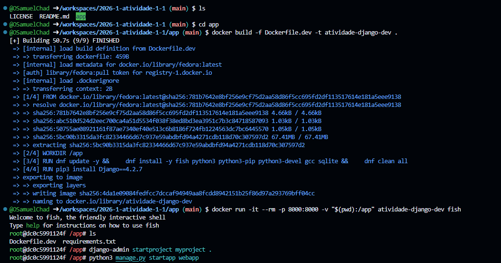
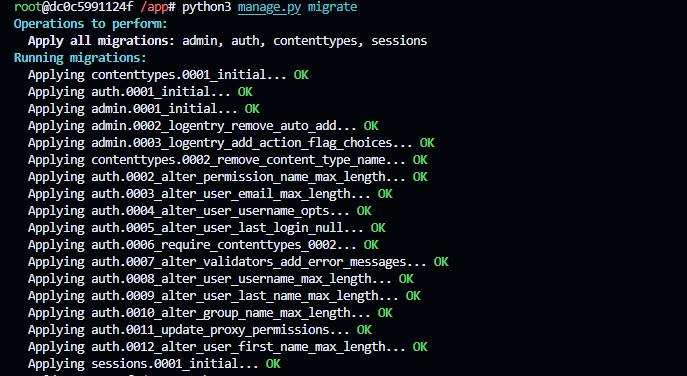
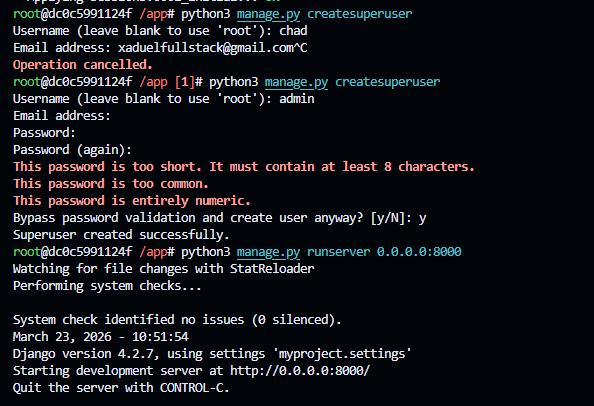
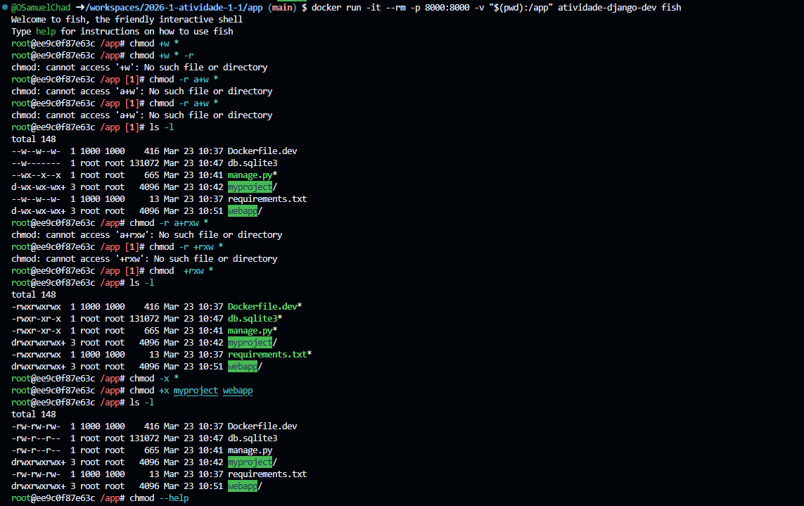
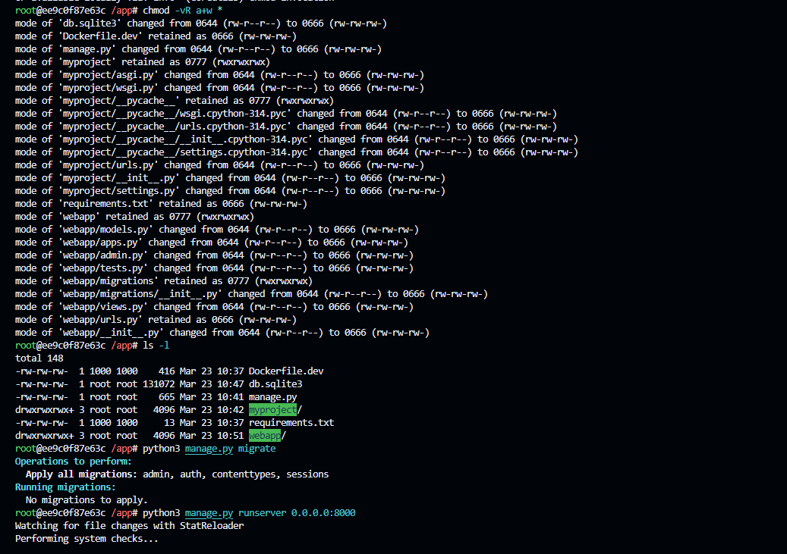
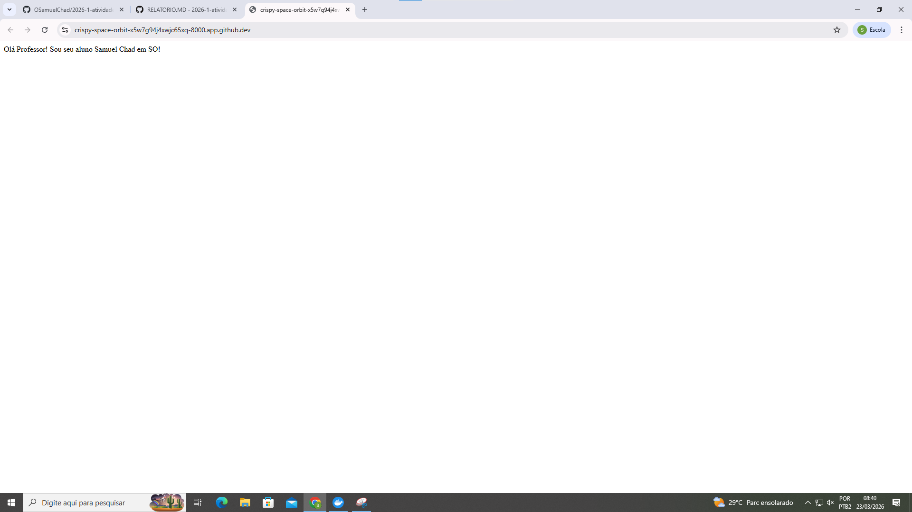
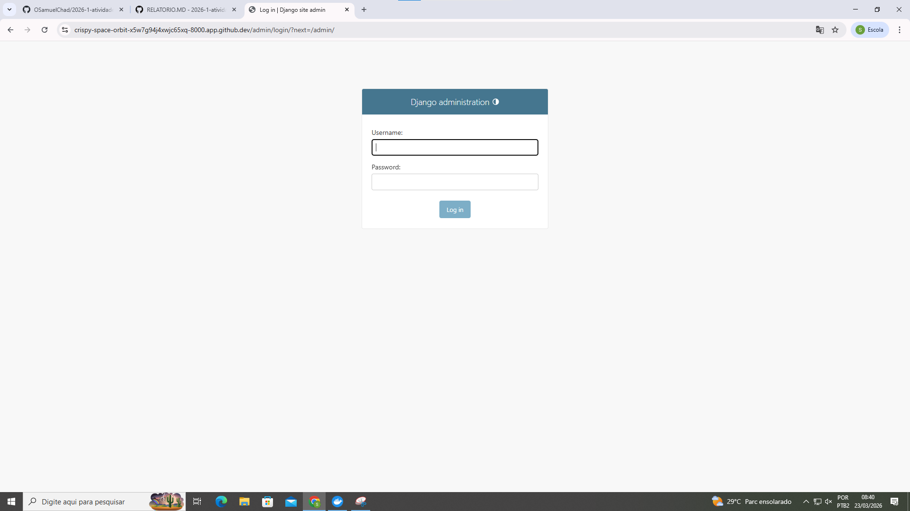
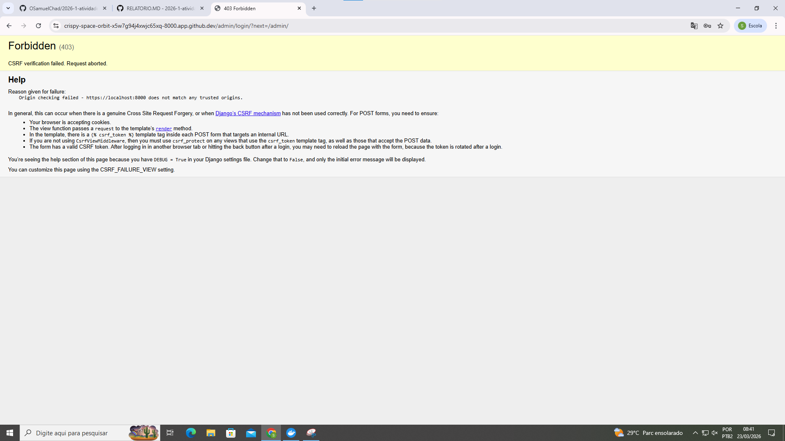

Relatório de Atividade 1.1: Virtualização e Containers em SO
Estudante: [Samuel Chad Dantas da Silva]

Instituição: IFRN - TADS

Disciplina: Sistemas Operacionais

1. Introdução e Objetivos
Nesta atividade, o meu objetivo foi configurar um ambiente de desenvolvimento Django utilizando Docker. A ideia era isolar todas as dependências do projeto dentro de um container baseado em Fedora, garantindo que o ambiente fosse replicável. Foquei em aprender a construção de imagens personalizadas, o uso de volumes para persistência de dados e o mapeamento de portas para acessar a aplicação pelo navegador do meu sistema hospedeiro.

2. Construção da Imagem e Execução
Comecei estruturando o Dockerfile.dev. Usei o Fedora como base e instalei o Python e o shell Fish. Para gerar a imagem, executei o comando:
docker build -f Dockerfile.dev -t atividade-django-dev .

Após o build, subi o container integrando minha pasta local com a pasta /app do container:
docker run -it --rm -p 8000:8000 -v "$(pwd):/app" atividade-django-dev fish

O uso do volume foi essencial, pois permitiu que eu editasse o código no meu editor de preferência e visse o resultado rodando imediatamente dentro do ambiente isolado.

3. O Problema das Permissões de Root
Um dos maiores desafios que enfrentei foi lidar com a propriedade dos arquivos. Como o Docker executa os processos como root, todos os arquivos criados por ele (como as pastas do Django e o banco de dados db.sqlite3) ficaram bloqueados para edição no meu usuário comum.

Tentei liberar o acesso usando o comando chmod, mas bati cabeça com a sintaxe. Tentei chmod -r, o que gerou erros de "No such file or directory", já que o parâmetro correto para recursividade é -R (maiúsculo). Após consultar o manual, consegui aplicar a permissão de escrita para todos os arquivos e subpastas com o comando:
chmod -vR a+w *

4. Desenvolvimento da Aplicação
Com as permissões resolvidas, executei as seguintes etapas dentro do container:

Criei o projeto e a app (webapp).

Rodei o python3 manage.py migrate para estruturar o banco de dados.

Criei o superusuário admin.

Configurei uma view simples que exibe a mensagem: "Olá Professor! Sou seu aluno [Seu Nome] em SO!".

5. O Impasse do Erro de CSRF
Ao tentar acessar o painel administrativo (/admin/), me deparei com o erro 403 Forbidden: Origin checking failed. O log do terminal indicava que a origem https://localhost:8000 não era confiável.

Eu realizei diversas tentativas de correção no arquivo settings.py, incluindo:

Definir ALLOWED_HOSTS = ['*'].

Adicionar a URL ao CSRF_TRUSTED_ORIGINS.

Tentar variações com e sem a porta 8000.

Apesar de ter configurado as origens confiáveis conforme a documentação do Django, o erro persistiu e o acesso ao painel administrativo continuou bloqueado. Entendi que, por estar em um ambiente de desenvolvimento específico (como o Codespaces), o Django exige uma configuração de segurança ainda mais fina ou o uso de headers de proxy que não foram totalmente resolvidos durante a execução desta atividade.

6. Considerações Finais
A atividade foi muito importante para eu entender como um Sistema Operacional gerencia privilégios e isolamento. O meu maior aprendizado foi lidar com as permissões de arquivos entre o host e o container, algo que acontece muito no dia a dia. Mesmo que o problema do CSRF não tenha sido totalmente solucionado, a experiência de debugar as camadas de segurança do Django e entender como o Docker expõe serviços para a rede foi fundamental para minha formação.

### Imagens:

Fase inicial e Criação do Projeto

Fazendo a Migração do Sqlite nativo no Django

Criando superuser e rodando

Problemas de Permissão

Ajuste do Problema de Permissões e rodando novamente

### Telas:

**Possivel problema de middleware...**

